# Capability Insights for AWS

[](https://github.com/aws/capability-insights-for-aws/actions/workflows/build.yml)
[](https://github.com/aws/capability-insights-for-aws/releases/latest)
[](LICENSE)

Deploy a regional availability dashboard into your own AWS account, powered by data from [AWS Capabilities By Region](https://builder.aws.com/build/capabilities).

## Table of Contents

- [Overview](#overview)
- [Installation](#installation)
  - [Data Layer Onboarding](#data-layer-onboarding)
- [Accessing the Website](#accessing-the-website)
- [User Guide](#user-guide)
- [Architecture](#architecture)
- [Development](#development)
- [License](#license)

## Overview

[AWS Capabilities By Region](https://builder.aws.com/build/capabilities) helps you discover and compare AWS services, features, APIs, and CloudFormation resources across regions. With detailed availability data and forward-looking roadmap information, you can make informed decisions about global deployments and avoid project delays. You can explore this data on our [public website](https://builder.aws.com/build/capabilities), which covers over 35 regions across the commercial, AWS GovCloud (US), and European Sovereign Cloud partitions.

This open-source solution builds on top of AWS Capabilities By Region by deploying a searchable dashboard into your own AWS account. Data is pulled directly into your AWS account, accessible inside your own VPC, and refreshes automatically every 24 hours. If your organization has been granted access to additional data sources beyond what's publicly available, this solution can incorporate those as well, giving you a unified view across all [partitions](https://docs.aws.amazon.com/IAM/latest/UserGuide/reference-arns.html) you have access to. To learn more about accessing additional data, work with your AWS representative.

The dashboard covers:

- **Services and features** — availability status, expected launch dates, and expansion plans per region
- **API operations** — individual API action availability per region for each AWS service
- **CloudFormation resource types** — which resource types are supported in each region
- **Personalized usage (opt-in)** — a "My Stuff" view that filters everything down to services, APIs, and resources actually used in your account, derived from CloudTrail and CloudFormation
- **Regional governance policies (opt-in)** — generate IAM Managed Policies and Service Control Policies that deny capabilities not available in your chosen regions
- **Conversational assistant (opt-in)** — a chat drawer that answers availability, comparison, and usage questions in natural language; the model interprets intent while the answer is computed deterministically from the same capability catalog

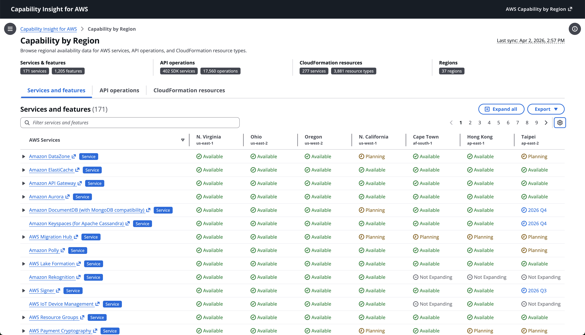

The solution deploys entirely within your VPC so that all data remains within your network. You provide your own VPC, subnets, and S3 bucket so the solution integrates with your existing infrastructure and security controls.

### Solution Architecture

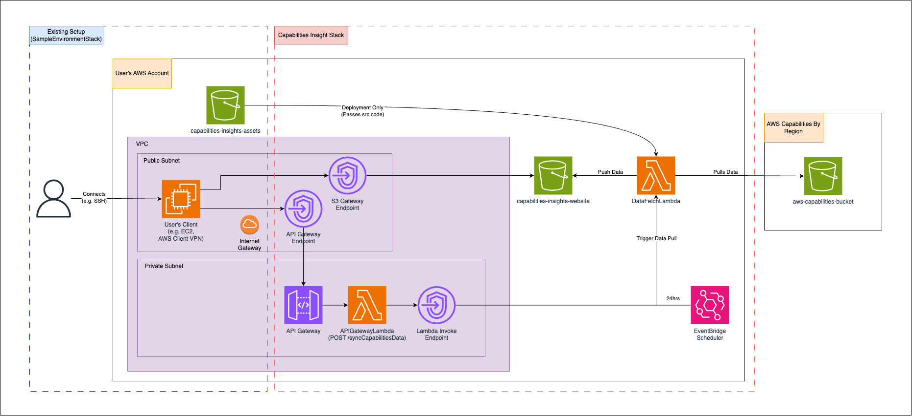

The solution deploys a static website, REST API, and Lambda functions into your VPC. Personalization is provided by an opt-in second stack that adds a Step Functions state machine and analyzer Lambdas that read your account's CloudTrail logs and CloudFormation stacks.

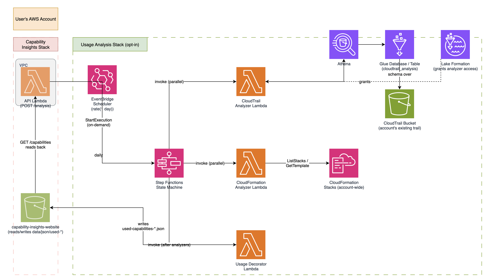

A separate opt-in stack adds regional governance: a REST API and Lambdas that generate IAM Managed Policies or Service Control Policies whose allow-lists reflect what's available in your chosen regions, derived from the same capability catalog the dashboard uses.

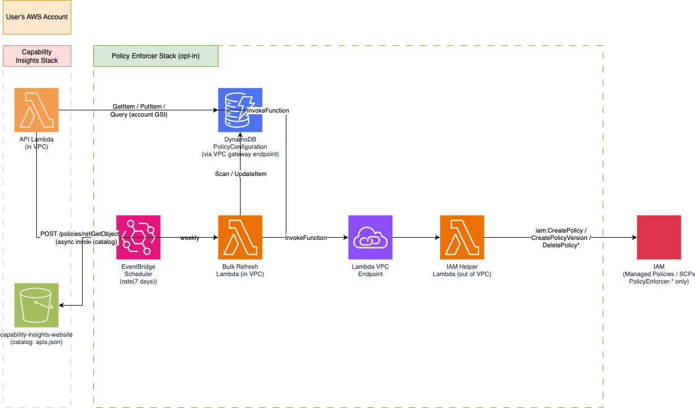

A further opt-in stack adds a conversational assistant: an out-of-VPC Lambda runs a Bedrock tool-use loop (Amazon Bedrock has no VPC endpoint), and the in-VPC API Lambda forwards chat requests to it. The model only interprets intent and chooses query parameters — counts, rankings, and region diffs are computed in code against the same capability catalog the dashboard uses, so answers cannot be hallucinated. The assistant performs no mutations.

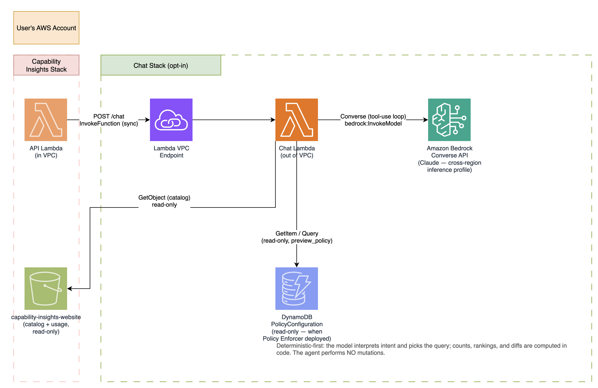

For a detailed breakdown of all resources, see [Architecture](#architecture).

## Installation

Capability Insights for AWS consists of a CloudFormation stack, Lambda function code, and a static website. You can deploy these using our automated script, which builds and deploys everything in one step. If your organization requires deploying with native AWS tooling only, you can download pre-built artifacts from our [GitHub Releases](https://github.com/aws/capability-insights-for-aws/releases/latest) and deploy them directly with the AWS CLI.

### Prerequisites

**On your machine:**

- [AWS CLI](https://aws.amazon.com/cli/) configured with credentials for the target AWS account

**In your AWS account:**

Capability Insights for AWS deploys into your existing network infrastructure. You will need the following in the AWS account and region where you want the dashboard accessible:

| Resource                            | Description                                                                         |
| ----------------------------------- | ----------------------------------------------------------------------------------- |
| VPC                                 | The VPC where you want the dashboard deployed. Must have DNS resolution enabled.    |
| └ Subnet (with internet gateway)    | Users access the dashboard from this subnet.                                        |
| └ Subnet (without internet gateway) | Lambda functions run here securely with no direct internet access.                  |
| S3 access point ARN                 | How the solution reads capability data from the source. Provided during onboarding. |

If you don't have an existing VPC and subnets to deploy into, we provide a [Sample Environment Stack](#sample-environment-stack-optional) that creates these resources for you.

The solution deploys to whichever region is configured in your AWS CLI profile. To check your current region, run `aws configure get region`. To change it, run `aws configure set region <REGION>`.

### Data Layer Onboarding

**PUBLIC:** No onboarding is required to access the public data set (regional availability data set for commercial regions). Use the following S3 access point ARN: `arn:aws:s3:us-east-1:686591367145:accesspoint/aws-capabilities-public`

**PREVIEW:** For PREVIEW (Internal and in-build regions) onboarding, please connect with your AWS Account Team to prepare the required authorization documents and cut a ticket with the documents attached. The team will then review and initiate the onboarding process.

### Automated Installation

In addition to the prerequisites above, you will need [Node.js](https://nodejs.org/) (includes `npm` and `npx`).

1. Clone this repository:

   ```bash
   git clone https://github.com/aws/capability-insights-for-aws.git
   cd capability-insights-for-aws
   ```

2. Create an S3 bucket for deployment assets with public access blocked. This bucket is used exclusively to store the Lambda code package during deployment. We recommend naming it `capability-insights-assets-<ACCOUNT_ID>-<REGION>`.

3. Install dependencies:

   ```bash
   npm install
   ```

4. Run the deploy script:

   ```bash
   npm run deploy
   ```

   The script builds all assets, prompts for parameters, deploys the CloudFormation stack, uploads the website, and triggers an initial data sync.

   You will be prompted for `SourceFolders`, a comma-separated list of data sources to pull from. The default is `public`. If your organization has been granted access to additional [partitions](https://docs.aws.amazon.com/IAM/latest/UserGuide/reference-arns.html), include them as well (e.g., `aws-cn,public`).

Once complete, see [Accessing the Website](#accessing-the-website).

#### Deploy Flags

All parameters can be passed as flags to skip the interactive prompts:

```bash
npm run deploy -- \
  --private-vpc-id vpc-0abc123 \
  --backend-subnet-id subnet-0abc123 \
  --api-access-subnet-id subnet-0def456 \
  --deployment-assets-bucket-name my-deploy-bucket \
  --source-access-point-arn arn:aws:s3:us-east-1:123456789012:accesspoint/my-access-point \
  --source-folders aws-cn,public \
  --enable-usage-analysis
```

| Flag                              | Description                                                                                                                                                                                                                                                    |
| --------------------------------- | -------------------------------------------------------------------------------------------------------------------------------------------------------------------------------------------------------------------------------------------------------------- |
| `--private-vpc-id`                | VPC ID. Must have DNS resolution and DNS hostnames enabled.                                                                                                                                                                                                    |
| `--backend-subnet-id`             | Subnet without an internet gateway, used for Lambda compute. Must have a route to S3 via a Gateway VPC Endpoint, and to DynamoDB if `--enable-policy-enforcer` is set.                                                                                         |
| `--api-access-subnet-id`          | Subnet with an internet gateway, used for user access and the API Gateway VPC Endpoint.                                                                                                                                                                        |
| `--deployment-assets-bucket-name` | S3 bucket where deployment assets (Lambda code zip) are stored.                                                                                                                                                                                                |
| `--source-access-point-arn`       | S3 access point ARN for the capability data source (provided during onboarding).                                                                                                                                                                               |
| `--source-folders`                | Comma-separated list of data sources to pull from (default: `public`). Include additional partitions if granted access.                                                                                                                                        |
| `--enable-usage-analysis`         | Deploy the opt-in Usage Analysis stack to enable personalization.                                                                                                                                                                                              |
| `--cloudtrail-bucket`             | CloudTrail logs bucket used by the analyzer (only with `--enable-usage-analysis`). Auto-discovered if omitted.                                                                                                                                                 |
| `--enable-policy-enforcer`        | Deploy the opt-in Policy Enforcer stack to enable regional governance policy generation.                                                                                                                                                                       |
| `--enable-chat`                   | Deploy the opt-in Chat assistant stack. Requires Amazon Bedrock with Claude model access enabled in the deployment region.                                                                                                                                     |
| `--bedrock-model-id`              | Bedrock model or cross-region inference profile id for chat (only with `--enable-chat`). Defaults to `us.anthropic.claude-haiku-4-5-20251001-v1:0`.                                                                                                            |
| `--deployer-role-name`            | IAM role name this deployment runs as. Registered as a Lake Formation Data Lake Admin by the Usage Analysis stack so its grants succeed (only relevant with `--enable-usage-analysis`). Derived from your caller identity if omitted, falling back to `Admin`. |

#### Deploying without Admin access

By default the deploy runs with whatever credentials you have, which are often Admin. To deploy under a **least-privilege role** instead, use the example IAM policies in [`docs/`](docs/deployment-iam-policy.md). They are split so you attach only what you enable:

| File                                              | Attach when                       |
| ------------------------------------------------- | --------------------------------- |
| `docs/deployment-iam-policy-base.json`            | Always (required)                 |
| `docs/deployment-iam-policy-usage-analysis.json`  | with `--enable-usage-analysis`    |
| `docs/deployment-iam-policy-policy-enforcer.json` | with `--enable-policy-enforcer`   |
| `docs/deployment-iam-policy-chat.json`            | with `--enable-chat`              |
| `docs/deployment-role-trust-policy.json`          | example trust policy for the role |

Create a role, attach the base policy plus the add-on(s) for the stacks you enable, then deploy while assuming that role and pass `--deployer-role-name <RoleName>`. That name is registered as a Lake Formation Data Lake Admin by the Usage Analysis stack, so its permission grants succeed under a non-admin principal. Full steps are in [docs/deployment-iam-policy.md](docs/deployment-iam-policy.md).

#### Teardown

> **Warning**: This will empty the website bucket (static assets and capability data) and delete the CloudFormation stack.

```bash
npm run teardown
```

### Manual Installation

For organizations that require deploying with native AWS tooling only, pre-built deployment artifacts are published with each [release](https://github.com/aws/capability-insights-for-aws/releases/latest). This path uses only the AWS CLI and standard CloudFormation. No Node.js, CDK, or build tools needed.

Download `build-assets.zip` from the [latest release](https://github.com/aws/capability-insights-for-aws/releases/latest) and extract it. It contains:

- `lambda/lambdaAssets.zip` : Lambda function code
- `template/capability-insights.template.json` : CloudFormation template
- `website/` : compiled website files ready to upload to S3

Then follow these steps:

1. Create an S3 bucket for deployment assets with public access blocked. This bucket is used exclusively to store the Lambda code package during deployment. We recommend naming it `capability-insights-assets-<ACCOUNT_ID>-<REGION>`.

2. Upload the Lambda code to your deployment assets bucket:

   ```bash
   aws s3 cp lambda/lambdaAssets.zip s3://<DEPLOYMENT_ASSETS_BUCKET>/lambdaAssets.zip
   ```

3. Deploy the CloudFormation stack:

   ```bash
   aws cloudformation deploy \
     --template-file template/capability-insights.template.json \
     --stack-name CapabilityInsightsForAWS \
     --capabilities CAPABILITY_IAM CAPABILITY_NAMED_IAM \
     --parameter-overrides \
       PrivateVpcId=<VPC_ID> \
       BackendSubnetId=<BACKEND_SUBNET_ID> \
       ApiAccessSubnetId=<API_ACCESS_SUBNET_ID> \
       DeploymentAssetsBucketName=<DEPLOYMENT_ASSETS_BUCKET> \
       DeploymentAssetsBucketApiLambdaFunctionCodeZipPath=lambdaAssets.zip \
       SourceAccessPointArn=<SOURCE_ACCESS_POINT_ARN> \
       SourceFolders=<SOURCE_FOLDERS>
   ```

4. Upload the website assets:

   ```bash
   aws s3 sync website/ \
     s3://capability-insights-website-<ACCOUNT_ID>-<REGION>/
   ```

5. Trigger the initial data sync:

   ```bash
   aws lambda invoke \
     --function-name CapabilityInsightsDataFetchLambda \
     --invocation-type Event /dev/null
   ```

Once complete, see [Accessing the Website](#accessing-the-website).

#### Optional: Usage Analysis (personalization)

The "My stuff" personalization layer is an optional second stack
(`template/usage-analysis.template.json`, also in `build-assets.zip`). At a
high level the manual path is:

1. Deploy `CapabilityInsightsUsageAnalysis` (params: `WebsiteBucketName`,
   `WebsiteBucketArn`, `DeploymentAssetsBucketName`, `LambdaCodeZipPath`,
   `CloudTrailBucketName`).
2. Re-deploy the base stack with the new stack's outputs added as parameters
   (`AnalysisStateMachineArn`, `CloudTrailAnalyzerLambdaName`,
   `CloudFormationAnalyzerLambdaName`, `ConfiguredCloudTrailBucketName`).
3. Trigger the first run from the UI (Settings → Run analysis), or start the
   `AnalysisStateMachineArn` execution directly.

The scripted path (`npm run deploy -- --enable-usage-analysis`) automates all
of this; prefer it unless you're restricted to AWS CLI + CloudFormation only.
The "My stuff" toggle becomes usable once the first run finishes.

#### Optional: Policy Enforcer (regional governance)

The Policy Enforcer is an optional third stack
(`template/policy-enforcer.template.json`, also in `build-assets.zip`) that
generates IAM Managed Policies or Service Control Policies whose `NotAction`
allow-list reflects the capabilities available in your chosen regions. The
manual path:

1. Deploy `CapabilityInsightsPolicyEnforcer` (params: `PrivateVpcId`,
   `BackendSubnetId`, `WebsiteBucketName`, `DeploymentAssetsBucketName`,
   `LambdaCodeZipPath`).
2. Re-deploy the base stack with the new stack's outputs added as parameters
   (`PolicyTableName`, `IamHelperLambdaName`, `PolicyRefreshLambdaName`).
3. Open the dashboard's Policy Enforcer page (or `POST /policies`) to create
   your first policy.

The scripted path (`npm run deploy -- --enable-policy-enforcer`) automates all
of this. The backend subnet must be able to reach DynamoDB via a Gateway VPC
Endpoint — the Sample Environment stack provisions one for you, or add one to
the route table when bringing your own VPC.

#### Optional: Chat assistant (conversational interface)

> **Prerequisite — enable Bedrock model access first.** This is an account-level,
> per-region setting the deployment **cannot** turn on for you: the stack grants
> the Lambda permission to _call_ Bedrock, but your account must separately be
> granted access to the Claude model in the deployment region (Bedrock console →
> **Model access** → enable the Anthropic Claude model, accepting the use-case
> agreement if prompted). If it isn't enabled, the Chat stack still deploys
> cleanly but every chat request **fails at runtime** with an access-denied
> error. The scripted deploy runs a preflight check and warns when access is
> missing. Default model: `us.anthropic.claude-haiku-4-5-20251001-v1:0`
> (override with `--bedrock-model-id`).

The conversational assistant is an optional stack
(`template/chat.template.json`, also in `build-assets.zip`) that runs a
Bedrock-backed agent out-of-VPC (Amazon Bedrock has no VPC endpoint). The
manual path:

1. Deploy `CapabilityInsightsChat` (params: `DeploymentAssetsBucketName`,
   `LambdaCodeZipPath`, `WebsiteBucketName`, `PolicyTableName` —
   optional, enables the read-only `preview_policy` tool when set —
   and `BedrockModelId`).
2. Re-deploy the base stack with the new stack's `ChatLambdaName` output added
   as a parameter, which switches the chat drawer on in the dashboard.
3. Open the dashboard and use the **Ask** drawer to query availability,
   compare regions, or summarize usage.

The scripted path (`npm run deploy -- --enable-chat`) automates all of this.
When the stack is not deployed, the API returns 503 and the drawer stays
hidden — the dashboard degrades gracefully.

## Accessing the Website

The website is hosted on S3 and accessible only from within your VPC. After deployment, navigate to:

```
http://capability-insights-website-<ACCOUNT_ID>-<REGION>.s3-website-<REGION>.amazonaws.com
```

The automated deploy script prints this URL on completion.

Since the website is not publicly accessible, you need a way to reach it from within the VPC. Common options include:

- **Existing VPN or Direct Connect** — if your organization already has connectivity to the VPC, use it directly
- **AWS Client VPN** — set up a [Client VPN endpoint](https://docs.aws.amazon.com/vpn/latest/clientvpn-admin/what-is.html) in the VPC
- **EC2 instance with SOCKS proxy** — SSH into an instance in the VPC and proxy browser traffic through it (see [Accessing the Website from Your Machine](#accessing-the-website-from-your-machine) in the Development section for a step-by-step guide)

## User Guide

Once deployed, the dashboard provides a searchable view of AWS service, API, and CloudFormation resource availability across regions, plus an opt-in personalization layer that filters everything to what your account actually uses. This section walks through the main features.

### Browsing Services and Features

The main page shows all AWS services and features with their availability status across regions. Use the search bar to filter by name, and paginate or sort the columns as needed.

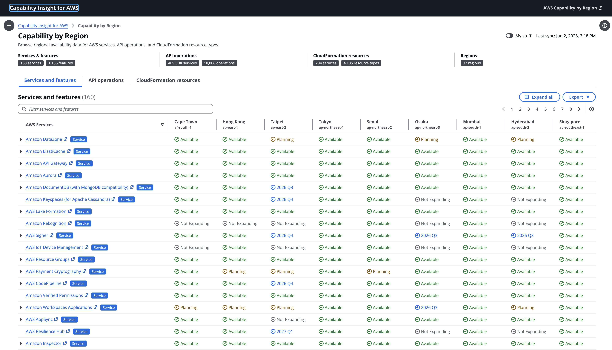

### Expanding Service Details

Click the arrow next to any service to expand it and see individual feature availability. Each feature shows its status per region, so you can quickly identify gaps.

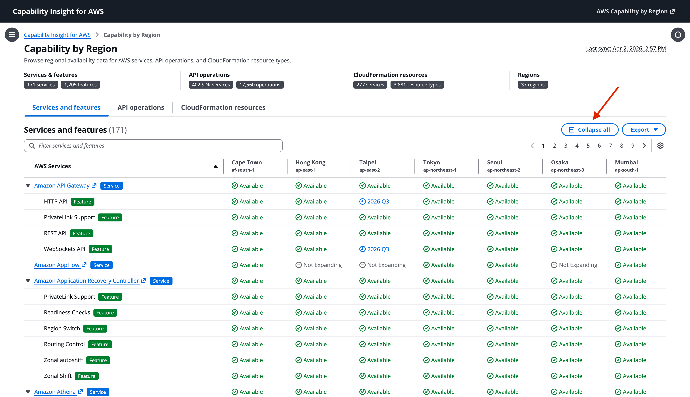

### Understanding Status Values

Click the info icon in the top-right corner to open the help panel. It explains each status value — Available, Planning, Not Expanding — and what date indicators like "2026 Q3" mean.

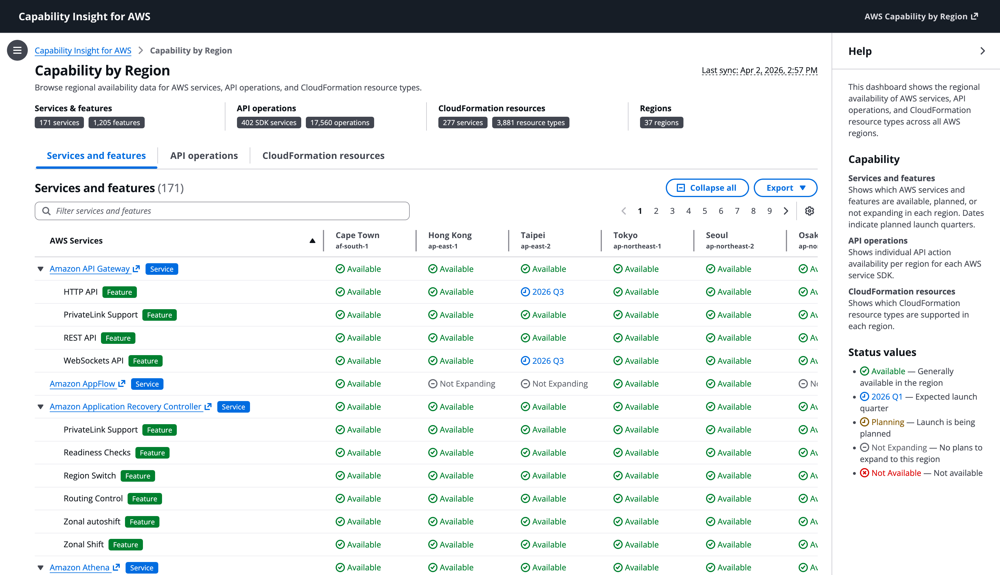

### Filtering by Planning Timeframe

To see a roadmap view of upcoming launches, add a **Planning timeframe** filter from the filter bar. Pick one or more quarters (the values are derived from the launch dates present in the catalog) and the table narrows to capabilities with a planned launch in those quarters. Combine it with a region filter to scope the roadmap to a single region — for example, `eu-west-2 = Planned` plus `Planning timeframe = 2026 Q4` shows only what is committed for that region in 2026 Q4. Items already available in the filtered region are excluded; historical launch dates never match.

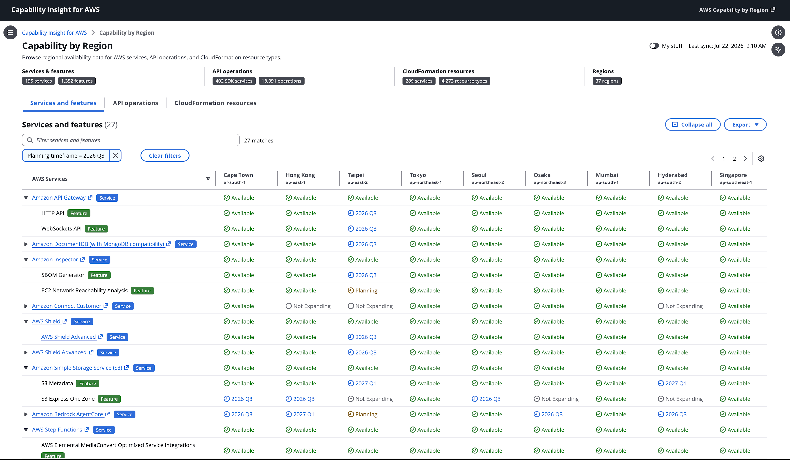

### Exporting Data

Click the Export button to download the current view as JSON or CSV. This is useful for sharing data with your team or feeding it into other tools.

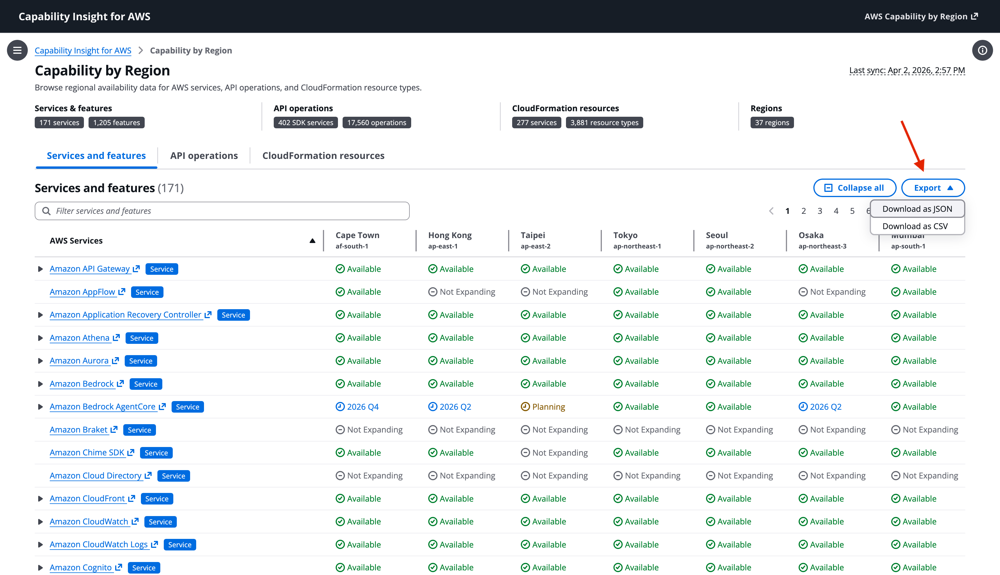

### Comparing Two Regions

The **Region Compare** page (in the side navigation) diffs the catalog between any two regions. Pick Region A and Region B to get summary counts — only in A, only in B, in both, in neither — and a per-item table across three tabs: Products, API operations, and CloudFormation resources. By default the table shows only the differences; use the **Show items available in both / neither** toggle to see everything, and the name filter to find specific capabilities. This is useful for parity checks, such as verifying what a newer region is still missing relative to your baseline region. The selection is kept in the URL, so a comparison can be bookmarked or shared.

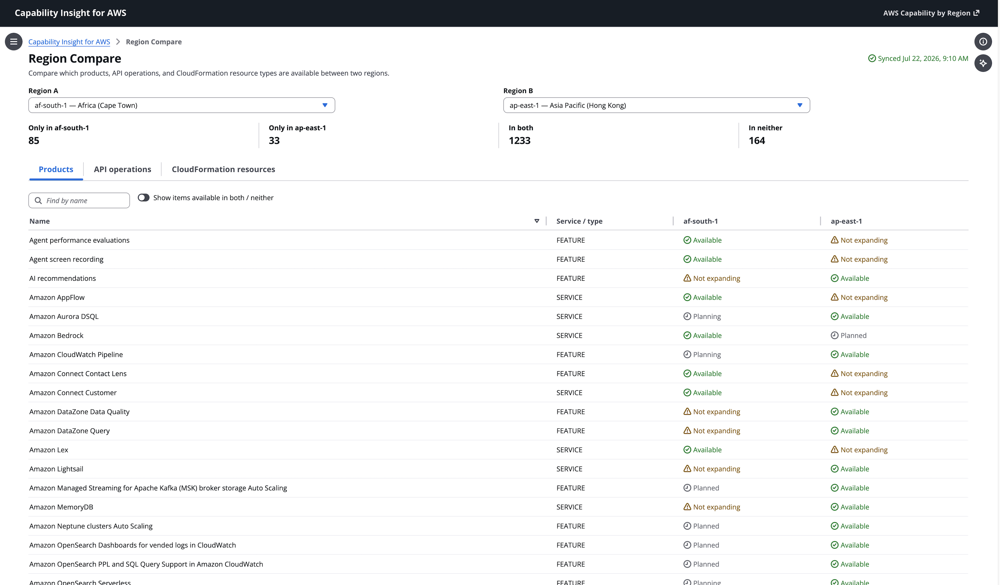

### Navigation and Settings

Open the side navigation to switch between the Capability by Region dashboard, the Region Compare page, the Policy Enforcer page (when deployed), and Settings. The Settings page lets you trigger a manual data refresh and, when the optional stacks are deployed, run usage analysis on demand and bulk-refresh every Policy Enforcer policy against the latest catalog.

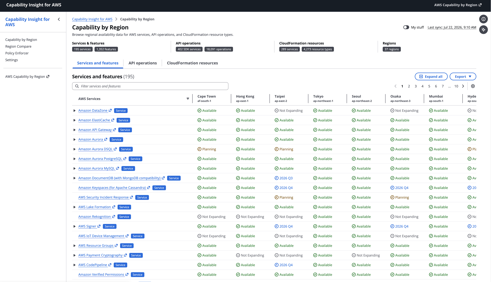

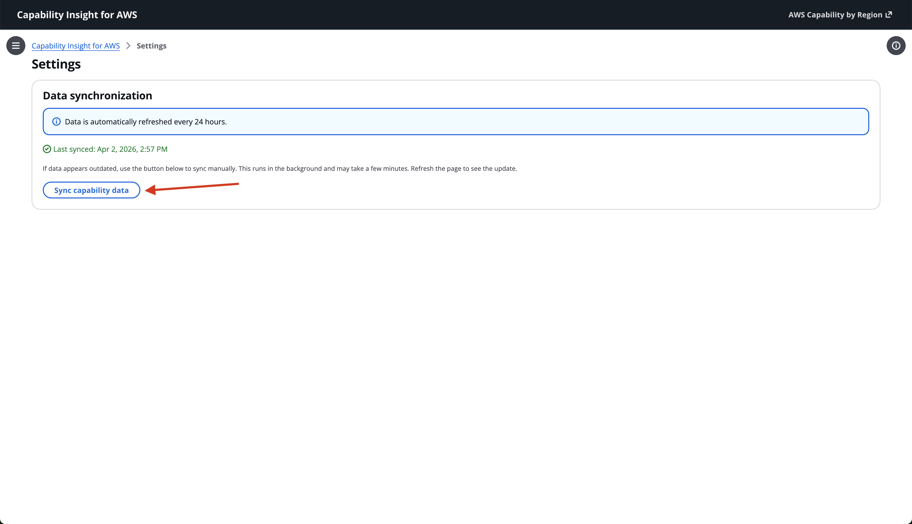

### Personalizing the dashboard (opt-in)

If you deployed with `--enable-usage-analysis`, the dashboard offers a **My stuff** toggle in the Capability by Region page header. With it on, the table filters down to only the services, APIs, and CloudFormation resources actually used in your account.

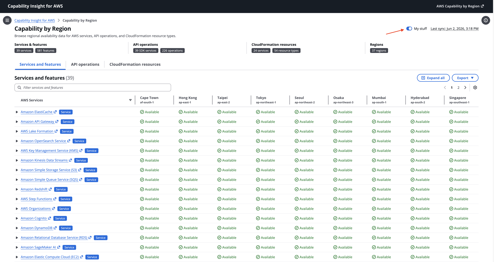

The CloudFormation tab also gains a **Stack** filter, letting you narrow resources to those deployed by specific CloudFormation stacks in your account.

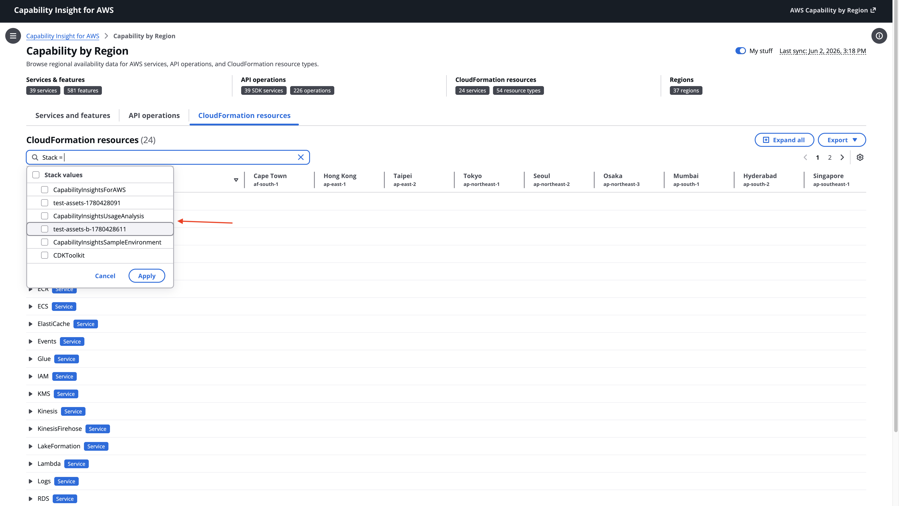

The personalized data is produced by analyzers that read your CloudTrail logs and active CloudFormation stacks, then written back to the website bucket as a personalized data set. The analysis runs on a daily schedule. You can also trigger it on demand from the Settings page using the **Run usage analysis** button. The page shows progress and result counts when the run completes; refresh the dashboard afterwards to see the updated personalization.

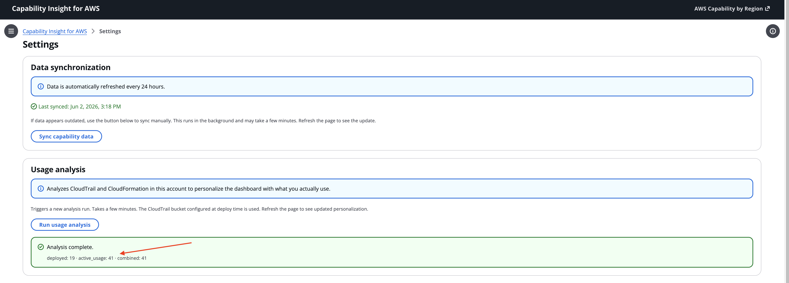

### Generating regional governance policies (opt-in)

If you deployed with `--enable-policy-enforcer`, the side navigation gains a **Policy Enforcer** entry. Use it to generate IAM Managed Policies or Service Control Policies that deny services and APIs unavailable in your target regions — useful when you want to confine workloads to a primary region without hand-curating allow-lists.

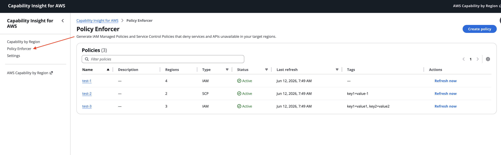

Click **Create policy** and provide a name, an optional description and tags, the target regions, a computation mode (intersection or union), and the policy type (IAM Managed Policy or Service Control Policy). Intersection produces an allow-list of capabilities available in _all_ selected regions; union produces one available in _any_ selected region.

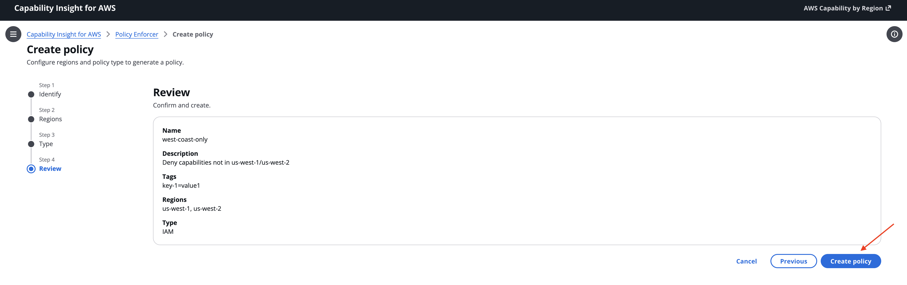

Once created, the policy detail page shows the configuration, refresh status, a preview of the generated allow-list, and the Policy ARNs of the resulting IAM Managed Policies. Service Control Policies that overflow a single 5,120-character document are split across multiple managed policies (Part 1, Part 2, etc.) up to the AWS Organizations limit of 5 per target — copy each document into the OU or account where you want to attach it.

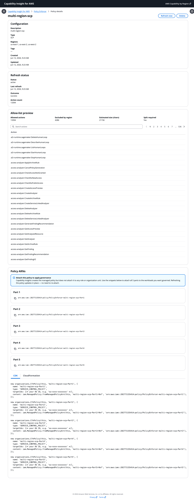

**Attaching the result is left to you**: for IAM-typed policies, attach `arn:...:policy/PolicyEnforcer-<name>` to the roles or users that should be governed; for SCP-typed policies, copy each document and attach it to the target OU or account in AWS Organizations.

To re-run every policy against a fresh catalog (e.g. after a daily DataFetch update introduces new APIs), use **Refresh all policies** on the Settings page. Individual policies also refresh whenever you re-save them.

### Asking the assistant (opt-in)

If you deployed with `--enable-chat`, the dashboard gains an **Ask** drawer. Pose questions in natural language — "is Bedrock available in eu-west-2", "compare us-east-1 and ap-south-1", "which services are in the fewest regions", or, when Usage Analysis is enabled, "what EC2 instance types am I using". The model interprets your intent and chooses how to query the catalog; the actual counts, rankings, and diffs are computed in code against the same data the dashboard shows, so the answer can't drift from the catalog. The assistant is read-only — it can preview an existing policy and propose a change for you to confirm, but it never creates, edits, or deletes anything itself.

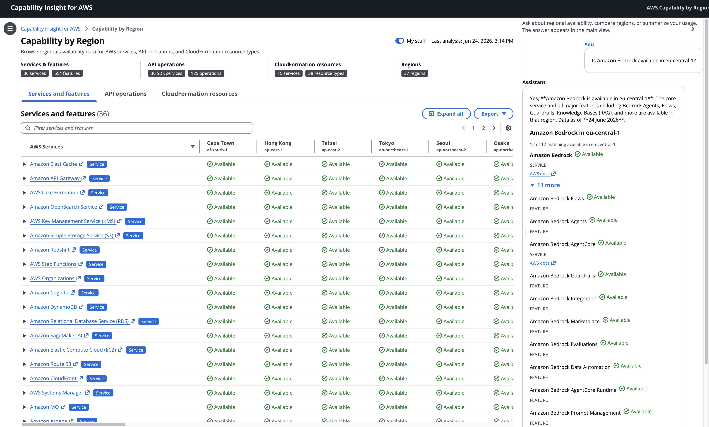

The answer renders inline in the drawer: a prose reply plus a structured card with the matching services, their availability status, and documentation links — alongside the catalog's freshness date.

## Architecture

This repository provides five CloudFormation stacks:

### Capability Insights Stack

The core solution. It deploys a website and API into your VPC, along with a Lambda function that periodically pulls capability data from the AWS Capabilities By Region S3 bucket and makes it available through the website.

| Resource                   | Description                                                                         |
| -------------------------- | ----------------------------------------------------------------------------------- |
| S3 Bucket                  | Hosts the static website and capability data                                        |
| API Gateway                | REST API accessible via VPC Endpoint                                                |
| API Gateway VPC Endpoint   | Allows the website to reach the API from within the VPC                             |
| API Lambda                 | Handles API requests from the website, runs in the subnet without internet access   |
| DataFetch Lambda           | Pulls capability data from the source S3 bucket and writes it to the website bucket |
| Lambda Invoke VPC Endpoint | Allows the API Lambda to invoke the DataFetch Lambda without internet access        |
| EventBridge Rule           | Triggers the DataFetch Lambda every 24 hours                                        |
| S3 Gateway Endpoint        | Allows the website bucket to be accessed from within the VPC                        |

### Sample Environment Stack (optional)

A development stack that mimics a customer environment for testing. Customers deploying the solution use their own existing VPC and subnets. This stack creates those resources so contributors can develop and test without one.

| Resource                  | Description                                       |
| ------------------------- | ------------------------------------------------- |
| VPC                       | VPC with DNS resolution and DNS hostnames enabled |
| Subnet (with internet)    | Subnet with an Internet Gateway for user access   |
| Subnet (without internet) | Isolated subnet for backend compute               |
| S3 Gateway Endpoint       | Allows instances to access S3 from within the VPC |
| S3 Bucket                 | Deployment assets bucket for Lambda code          |
| EC2 Instance (Linux)      | Amazon Linux 2023 instance for testing            |
| IAM Role                  | Instance role with SSM and S3 access              |

### Usage Analysis Stack (opt-in)

Adds personalization. Deployed when you pass `--enable-usage-analysis` to `npm run deploy`. Reads CloudTrail logs (via Athena) and active CloudFormation stacks to build a per-account view of services, APIs, and CloudFormation resources that are actually in use, then writes a personalized data set back to the website bucket. The dashboard's "My Stuff" toggle reads that data set.

| Resource                       | Description                                                                                |
| ------------------------------ | ------------------------------------------------------------------------------------------ |
| Step Functions State Machine   | Orchestrates the analyzers in parallel and runs the decorator                              |
| CloudTrail Analyzer Lambda     | Queries CloudTrail logs in Athena and emits per-service usage records                      |
| CloudFormation Analyzer Lambda | Lists active CloudFormation stacks and emits per-resource records                          |
| Usage Decorator Lambda         | Joins analyzer output with the master capability catalog and writes the personalized files |
| Glue Database / Table          | Schema over the CloudTrail bucket so the analyzer can run Athena queries                   |
| Lake Formation Permissions     | Grants the analyzer role read access to the Glue database                                  |
| EventBridge Rule               | Schedules the state machine to run daily (configurable via `AnalysisSchedule` parameter)   |

### Policy Enforcer Stack (opt-in)

Adds regional governance. Deployed when you pass `--enable-policy-enforcer` to `npm run deploy`. Exposes a REST API for creating named policies that select target regions and a computation mode (intersection or union), then generates an IAM Managed Policy or Service Control Policy whose `NotAction` allow-list is the set of capabilities available in those regions. The system creates and refreshes the policy resource on demand; **attaching it to roles or OUs is left to you**.

Refresh runs synchronously when you `POST /policies`, `PUT /policies/:id`, or `POST /policies/:id/refresh` — there is no background schedule. Catalog data only changes when the DataFetch Lambda runs, so re-computing on its own cadence has no benefit.

A generated allow-list can exceed AWS's per-document size limits. The feature handles this by splitting across multiple documents: IAM Managed Policies split at 6,144 characters each, and Service Control Policies split at 5,120 characters each across up to 5 documents (the AWS Organizations limit of 5 SCPs per target). Generation only fails when even 5 SCP documents cannot hold the allow-list — in which case, reduce scope (fewer regions, intersection mode) or use the IAM policy type.

| Resource                       | Description                                                                                    |
| ------------------------------ | ---------------------------------------------------------------------------------------------- |
| DynamoDB Table                 | Stores `PolicyConfiguration` records (regions, mode, exceptions, ARNs, refresh state)          |
| GSI: AccountIdIndex            | Backs the listing route's account-scoped Query                                                 |
| IAM Helper Lambda (out-of-VPC) | Performs `iam:*Policy*` mutations on behalf of the in-VPC API Lambda (IAM has no VPC endpoint) |
| Scoped IAM permissions         | Helper Lambda's role grants `iam:*Policy*` only on `arn:...:policy/PolicyEnforcer-*`           |

The `PolicyEnforcer-*` prefix on every managed policy this feature creates is **load-bearing** for the IAM scoping above — it limits the helper Lambda's blast radius to policies the feature itself owns.

### Chat Stack (opt-in)

Adds the conversational assistant. Deployed when you pass `--enable-chat` to `npm run deploy`. Runs a Bedrock tool-use agent loop in a Lambda placed **outside** the VPC, because Amazon Bedrock has no VPC endpoint; the in-VPC API Lambda forwards `POST /chat` to it synchronously. The agent reads the capability catalog (and, when present, the usage data and policy table) read-only and resolves every answer through the shared deterministic capability-query core — the model picks the query, code computes the result. The agent performs **no mutations**: the only write-adjacent tool is a read-only policy preview, and any change is surfaced as a proposal for the user to confirm against the existing gated routes.

| Resource                   | Description                                                                                           |
| -------------------------- | ----------------------------------------------------------------------------------------------------- |
| Chat Lambda (out-of-VPC)   | Runs the Bedrock Converse tool-use loop; reads catalog/usage from S3 and the policy table (read-only) |
| Scoped Bedrock permissions | Lambda role grants `bedrock:InvokeModel` on the configured model and cross-region inference profiles  |
| Scoped S3 / DynamoDB read  | `s3:GetObject` on the website bucket and read-only access to the Policy Enforcer table when present   |

The Chat Lambda holds no write permissions; mutations always run through the existing in-VPC gated routes after explicit user confirmation.

**Rollback**: the Chat stack is decoupled from the base stack — the only link is the optional `ChatLambdaName` parameter the base stack reads to wire up `POST /chat`. To disable chat, delete the Chat stack on its own:

```
aws cloudformation delete-stack --stack-name CapabilityInsightsChat
```

The base stack keeps running untouched; `POST /chat` returns 503 and the dashboard hides the assistant drawer — the same graceful-degradation path as a deployment that never enabled chat. (Re-running `npm run deploy` without `--enable-chat` is the scripted equivalent, and clears the `ChatLambdaName` parameter on the next base-stack update.)

### Package Structure

This project uses [npm workspaces](https://docs.npmjs.com/cli/using-npm/workspaces) to manage four packages under `source/`.

```
├── deployment/              # Deployment and dev scripts
│   ├── deploy.sh            # Deploy/teardown the Capability Insights stack
│   ├── dev.sh               # Deploy/teardown the CapabilityInsightsSampleEnvironment stack
│   └── check-deps.sh        # Validates required CLI tools (aws, node, npx)
├── docs/                    # Documentation assets
├── source/
│   ├── shared/              # Shared TypeScript types
│   ├── lambda/              # Lambda function code
│   ├── constructs/          # CDK infrastructure (synthesizes to CloudFormation)
│   └── website/             # React frontend
└── package.json             # Root workspace configuration
```

#### `source/constructs`

CDK application that defines the two CloudFormation stacks. We use CDK as a development tool to produce a standard CloudFormation template that can be deployed with the AWS CLI in any environment. No CDK installation required for deployment. On build, it synthesizes the Capability Insights stack and writes the template to `deployment/dist/template/`.

#### `source/lambda`

- **API Lambda** (`api-lambda-main.ts`): Backs the API Gateway and routes requests from the website.
- **DataFetch Lambda** (`data-fetch-lambda-main.ts`): Reads capability data from the source S3 access point, merges data across multiple source folders, and writes the results to the website bucket in both JSON and CSV formats.
- **CloudTrail Analyzer** (`cloudtrail-analyzer.ts`), **CloudFormation Analyzer** (`cloudformation-analyzer.ts`), **Usage Decorator** (`usage-decorator.ts`): Power the opt-in Usage Analysis stack. Triggered by a Step Functions state machine that runs the two analyzers in parallel, then the decorator merges their output with the master catalog into personalized files for the dashboard's "My Stuff" view.
- **Chat Lambda** (`chat-lambda-main.ts`): Powers the opt-in Chat assistant stack. Runs a Bedrock tool-use agent loop out-of-VPC; the tools (`chat/`) resolve every answer through the shared deterministic capability-query core, so the model interprets intent but never computes the result. Performs no mutations.

#### `source/website`

A React dashboard built with [Cloudscape Design System](https://cloudscape.design/) to visualize the capability data.

## Development

This repository contains two CloudFormation stacks. The Capability Insights stack is what users deploy into their existing infrastructure. The Sample Environment stack creates a VPC, subnets, EC2 instance, and deployment bucket that mimic a customer environment. Use it for local development and testing when you don't have an existing environment to deploy into.

Since the dashboard is only accessible from within the VPC, the sample stack includes an EC2 instance that you can SSH into and use as a proxy to reach the dashboard from your machine. See [Accessing the Website from Your Machine](#accessing-the-website-from-your-machine) for a step-by-step guide.

To get started, generate an SSH key pair and import it into EC2:

```bash
ssh-keygen -t ed25519 -f ~/.ssh/ci-key
aws ec2 import-key-pair --key-name ci-key --public-key-material fileb://~/.ssh/ci-key.pub
```

Then build and deploy the stacks:

```bash
# Install dependencies
npm install

# Deploy the CapabilityInsightsSampleEnvironment stack (optionally pass --ec2-key-pair <name>)
npm run dev:setup -- --ec2-key-pair ci-key

# Deploy Capability Insights using the CapabilityInsightsSampleEnvironment outputs
npm run dev:deploy

# Or, to also deploy the opt-in Usage Analysis stack for personalization:
npm run dev:deploy -- --enable-usage-analysis
```

`--enable-usage-analysis` auto-discovers the CloudTrail bucket from your account. Pass `--cloudtrail-bucket <name>` to override.

### Upgrading an Existing Deployment

`npm run dev:deploy` only updates the `CapabilityInsightsForAWS` and (if enabled) `CapabilityInsightsUsageAnalysis` stacks. It does **not** update the `CapabilityInsightsSampleEnvironment` stack, which provides the VPC, subnets, endpoints, and IAM the rest of the deployment depends on. A new version can change that stack (for example, adding a VPC endpoint), and skipping it leads to confusing runtime failures.

```bash
git pull
npm run dev:setup    # reconciles CapabilityInsightsSampleEnvironment (no-op if unchanged)
npm run dev:deploy   # then update Capability Insights itself (use the same flags as your initial deploy)
```

> If your initial deploy passed `--ec2-key-pair`, `--enable-usage-analysis`, or other flags, pass the same ones again — the scripts don't remember them between runs.

### Available Scripts

| Command                | Description                                                     |
| ---------------------- | --------------------------------------------------------------- |
| `npm run build`        | Build all assets (Lambda, CloudFormation template, website)     |
| `npm run deploy`       | Build and deploy to an existing VPC (interactive or with flags) |
| `npm run teardown`     | Remove the deployed stack and website assets                    |
| `npm run dev:setup`    | Deploy the CapabilityInsightsSampleEnvironment stack            |
| `npm run dev:deploy`   | Deploy using CapabilityInsightsSampleEnvironment stack outputs  |
| `npm run dev:teardown` | Tear down both stacks                                           |
| `npm run clean`        | Remove all build artifacts and node_modules                     |
| `npm run server`       | Start the website dev server locally                            |

### Accessing the Website from Your Machine

The website is only accessible from within the VPC. To browse it from your local machine, set up a SOCKS5 proxy through an EC2 instance in the VPC.

First, find your EC2 instance's public IP address:

1. Go to the AWS EC2 Console
2. Select the instance created by the CapabilityInsightsSampleEnvironment stack
3. Copy the Public IPv4 address from the instance details

```bash
ssh -D 8080 -N -i ~/.ssh/ci-key ec2-user@<EC2_INSTANCE_PUBLIC_IP>
```

Launch Chrome using that proxy:

**On macOS:**

```bash
/Applications/Google\ Chrome.app/Contents/MacOS/Google\ Chrome \
  --proxy-server="socks5://localhost:8080" \
  --user-data-dir="/tmp/chrome-proxy"
```

**On Windows:**

```bash
"C:\Program Files\Google\Chrome\Application\chrome.exe" ^
  --proxy-server="socks5://localhost:8080" ^
  --user-data-dir="%TEMP%\chrome-proxy"
```

Finally, navigate to the website URL:

```
http://capability-insights-website-<ACCOUNT_ID>-<REGION>.s3-website-<REGION>.amazonaws.com
```

## License

This project is licensed under the Apache-2.0 License. See the [LICENSE](LICENSE) file.
